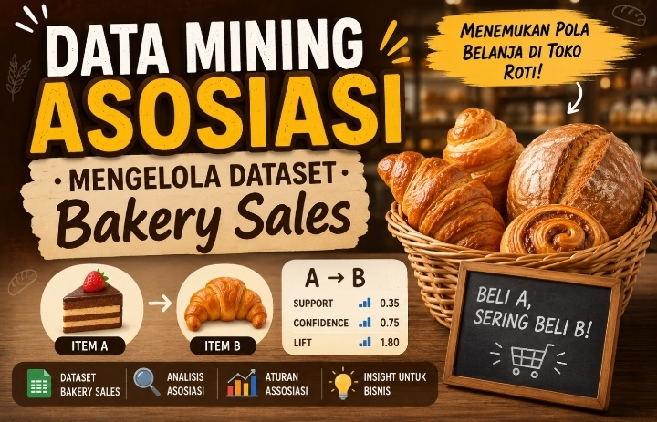

# 🍞 Analisis Pola Pembelian Pelanggan Toko Roti menggunakan Association Rule Mining

### Nama : MUHAMAD REZA FAURIZKI
### Nim  : 1224160028

| **Portofolio Google Sites** | [Klik di sini](https://sites.google.com/view/muhamadrezafaurizki) |
| **Video Presentasi** | [Klik di sini](https://youtu.be/JLcLge1dUt0?si=l2dMGkSFGd2Ogj19) |

---

## 📌 **Ringkasan Proyek**

Proyek ini merupakan implementasi teknik **Association Rule Mining** untuk menganalisis pola pembelian pelanggan pada sebuah toko roti (*bakery*). Dengan menggunakan algoritma **Apriori** dan **FP-Growth**, proyek ini berhasil menemukan kombinasi produk yang sering dibeli bersamaan oleh pelanggan.

**Tujuan utama** dari analisis ini adalah:
- Menemukan pola pembelian pelanggan (produk apa yang sering dibeli bersama).
- Menghasilkan aturan asosiasi yang dapat digunakan untuk strategi bisnis.
- Memberikan rekomendasi berbasis data untuk meningkatkan penjualan.

**Hasil analisis** menunjukkan bahwa terdapat 9 aturan asosiasi dengan nilai **Lift > 1**, yang berarti hubungan antar produk saling mempengaruhi secara positif. Salah satu aturan terkuat adalah **Soup → Tea** dengan nilai Lift **1.45**.

---

## 📊 **Dataset**

| **Statistik** | **Nilai** |
|---|---|
| **Nama File** | Bakery sales dataset.csv |
| **Total Baris Data** | 20,507 baris |
| **Transaksi Unik** | 9,465 transaksi |
| **Jumlah Produk Unik** | 94 produk |
| **Rata-rata Item per Transaksi** | 2.17 item |
| **Periode Data** | Oktober 2016 - April 2017 |

---

## 🛠️ **Tools & Library**

| **Kategori** | **Tools / Library** |
|---|---|
| **Bahasa Pemrograman** | Python 3.9+ |
| **Data Processing** | Pandas, NumPy |
| **Visualisasi** | Matplotlib, Seaborn |
| **Association Rule Mining** | MLxtend (Apriori, FP-Growth) |
| **Environment** | Jupyter Notebook |

---

---

## 📈 **Hasil Analisis**

### Top 5 Association Rules

| **Jika Membeli** | **Maka akan Membeli** | **Support** | **Confidence** | **Lift** |
|---|---|---|---|---|
| Soup | Tea | 1.56% | 30.07% | **1.45** |
| Scone | Tea | 1.43% | 26.07% | **1.25** |
| Cake | Tea | 4.08% | 25.45% | **1.22** |
| Toast | Coffee | 4.06% | **73.68%** | **1.22** |
| Salad | Coffee | 1.12% | **68.13%** | **1.13** |

### Kriteria Sukses (Target 80%)

| **Kriteria** | **Hasil** | **Status** |
|---|---|---|
| Rules dengan Lift > 1 | 100% | ✅ **LULUS** |
| Rules dengan Confidence > 30% | 77.8% | ⚠️ Perlu Peningkatan |
| Rata-rata Confidence | 47.01% | ✅ Baik |

---

## 💡 **Rekomendasi Bisnis**

1. **Strategi Bundling Produk**
   - Paket **"Tea Time"**: Tea + Soup (Lift: 1.45)
   - Paket **"Breakfast Set"**: Coffee + Toast (Lift: 1.22)

2. **Optimasi Tata Letak Toko**
   - Letakkan produk yang saling terkait secara berdekatan.
   - Contoh: Rak Soup di dekat rak Tea.

3. **Program Promosi**
   - Diskon untuk pembelian kombinasi produk.
   - Buy One Get One untuk produk yang saling terkait.

4. **Pelatihan Staf**
   - Latih staf untuk menawarkan produk tambahan (*cross-selling*).

---

## 📊 **Visualisasi Hasil**

| **Gambar** | **Deskripsi** |
|---|---|
| `distribusi_produk.png` | 15 produk terlaris di toko roti |
| `histogram_metrik.png` | Distribusi Support, Confidence, dan Lift |
| `scatter_support_confidence.png` | Scatter plot Support vs Confidence (warna = Lift) |
| `heatmap_cooccurrence.png` | Heatmap produk yang sering muncul bersama |

---

## 🔗 **Link Penting**

| **Platform** | **Link** |
|---|---|
| **Portofolio Google Sites** | [Klik di sini](https://sites.google.com/view/muhamadrezafaurizki) |
| **Video Presentasi** | [Klik di sini](https://youtu.be/JLcLge1dUt0?si=l2dMGkSFGd2Ogj19) |

---

## 👤 **Kontak**

| **Platform** | **Informasi** |
|---|---|
| **Email** | [klik disini](mailto:mrezafaurizki05@gmail.com) |
| **LinkedIn** | [klik disini](https://www.linkedin.com/in/muhamad-reza-faurizki-7a122b416) |
| **GitHub** | [klik disini](https://github.com/mozzki-f) |

---

## 📝 **Lisensi**

Proyek ini dibuat untuk keperluan portofolio dan pembelajaran. Dataset yang digunakan bersumber dari [sumber dataset].

---

**© 2026 - Portofolio Data Mining**
